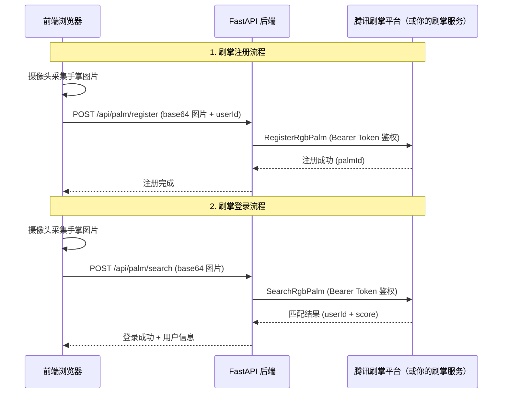

# 🔮 PalmDestiny — 掌纹天机 · AI 掌纹算命

[](https://opensource.org/licenses/MIT)
[](https://www.python.org/)
[](https://fastapi.tiangolo.com/)

**PalmDestiny（掌纹天机）** 是一个开源的 AI 掌纹算命 Web 应用，通过摄像头拍摄手掌照片，结合大语言模型（LLM）生成趣味性的掌纹分析报告，包括生命线、智慧线、感情线解读，以及八字、星座、生肖运势等综合分析。

> **一句话介绍：** 拍一张手掌照片，AI 帮你看手相、算八字、测运势——纯娱乐，不收集个人信息。

## ✨ 特色功能

### 🖐️ 掌纹分析
- **AI 看手相**: 基于大语言模型的掌纹图像分析，解读生命线、智慧线、感情线
- **刷掌识别**: 支持接入掌纹识别服务进行身份验证（可选）
- **实时拍摄**: 通过浏览器摄像头实时拍摄手掌照片

### 🎯 运势分析
- **八字分析**: 根据出生日期计算八字，AI 生成八字运势解读
- **星座分析**: 根据生日自动判断星座，生成星座运势报告
- **生肖宜忌**: 根据生肖生成每日宜忌建议
- **综合报告**: 整合掌纹、八字、星座等多维度的 AI 综合运势报告

### 🎨 用户体验
- **现代化 UI**: 精美的中国风 + 现代设计风格界面
- **响应式布局**: 适配桌面和移动端
- **流畅动画**: CSS3 过渡动画和交互反馈

## 🔐 腾讯刷掌平台 API 集成 | Tencent Palm Platform API

PalmDestiny 推荐使用[腾讯刷掌开放平台](https://palm.tencent.com)进行用户身份验证，实现刷掌注册和刷掌登录。当然，你也可以接入自己的刷掌识别服务，只需实现相同的接口协议即可。

### 集成的核心 API 能力

| API | 功能 | 说明 |
|:---|:---|:---|
| `RegisterRgbPalm` | RGB 手掌注册 | 上传手掌 RGB 图片，完成掌纹特征注册，绑定用户身份 |
| `SearchRgbPalm` | RGB 手掌搜索识别 | 上传手掌 RGB 图片，进行 1:N 掌纹搜索匹配，返回用户身份 |

### 调用流程



### 鉴权与安全机制

- **Bearer Token 鉴权** — 后端使用配置文件中的 API Token 通过 Bearer 方式鉴权，前端无需感知凭证细节
- **HTTPS 传输加密** — 所有请求通过 HTTPS 加密通道传输，保护生物特征数据安全
- **活体防作弊检测** — 平台内置活体检测能力，防止照片/视频/模型等攻击手段

### 使用自己的刷掌服务

如果你不使用腾讯刷掌平台，也可以接入自己的刷掌识别服务。只需在 `.env` 中配置你的服务地址和鉴权信息：

```env
PALM_API_BASE_URL=你的刷掌算法服务网址
PALM_API_BEARER_TOKEN=你的刷掌算法Token
PALM_API_GATEWAY_PATH=你的网关路径
```

确保你的服务实现了兼容的注册和搜索接口即可无缝替换。

---

## 🏗️ 程序架构

```
┌─────────────────────────────────────────────────────┐
│                    前端 (HTML/CSS/JS)                  │
│  index.html / script.js / script-part2.js / style.css │
├─────────────────────────────────────────────────────┤
│                    后端 (FastAPI)                      │
│                      main.py                          │
├──────────┬──────────┬──────────┬────────────────────┤
│ API路由  │ 服务层    │ 模型层   │ 工具层              │
│ routes.py│ services/ │ models/  │ utils/              │
├──────────┴──────────┴──────────┴────────────────────┤
│                   核心服务                             │
│  ┌─────────────┐ ┌──────────────┐ ┌───────────────┐ │
│  │ 大模型客户端 │ │ 掌纹识别客户端│ │ 图像处理工具  │ │
│  │ hunyuan/qwen│ │palm_recognize│ │image_processing│ │
│  └─────────────┘ └──────────────┘ └───────────────┘ │
├─────────────────────────────────────────────────────┤
│                   数据层                              │
│            SQLite (palmistry.db)                      │
└─────────────────────────────────────────────────────┘
```

### 核心模块说明

| 模块 | 路径 | 说明 |
|------|------|------|
| 主入口 | `main.py` | FastAPI 应用主文件，包含所有 API 路由 |
| 配置 | `PalmDestiny/backend/app/core/config.py` | 环境变量配置管理 |
| 大模型服务 | `PalmDestiny/backend/app/services/hunyuan_client.py` | 腾讯云混元大模型客户端 |
| 掌纹识别 | `PalmDestiny/backend/app/services/palm_recognize_client.py` | 掌纹 1:N 识别客户端 |
| 图像处理 | `PalmDestiny/backend/app/utils/image_processing.py` | 手掌图像预处理工具 |
| 前端主页 | `static/index.html` | 主页面 |
| 前端逻辑 | `static/script.js` | 前端核心交互逻辑 |
| 掌纹注册 | `static/register.js` | 掌纹注册页面逻辑 |

## 🚀 快速开始

### 环境要求
- Python 3.10+
- 现代浏览器（Chrome 90+、Firefox 88+、Safari 15+）
- 支持摄像头的设备

### 安装运行

```bash
# 克隆项目
git clone https://github.com/nicewang/celina-PalmDestiny.git
cd celina-PalmDestiny

# 安装依赖
pip install -r requirements.txt

# 复制环境变量配置
cp .env.example .env
# 编辑 .env 填入你的实际配置（大模型密钥、掌纹服务地址等）

# 启动服务
python main.py

# 在浏览器中访问 http://localhost:8000
```

### 环境变量配置

参考 `.env.example` 文件，主要配置项：

| 变量名 | 说明 | 必填 |
|--------|------|------|
| `MODEL_TYPE` | 大模型类型（hunyuan/qwen） | 是 |
| `DEPLOYMENT_TYPE` | 部署方式（cloud/local） | 是 |
| `HUNYUAN_SECRET_ID` | 腾讯云混元 SecretId | 云端部署时必填 |
| `HUNYUAN_SECRET_KEY` | 腾讯云混元 SecretKey | 云端部署时必填 |
| `PALM_API_BASE_URL` | 你的刷掌算法服务网址 | 使用掌纹识别时必填 |
| `PALM_API_BEARER_TOKEN` | 你的刷掌算法 Token | 使用掌纹识别时必填 |

## 📁 项目结构

```
celina-PalmDestiny/
├── main.py                    # FastAPI 主入口
├── requirements.txt           # Python 依赖
├── .env.example              # 环境变量示例
├── Dockerfile                # Docker 构建文件
├── static/                   # 前端静态文件
│   ├── index.html            # 主页面
│   ├── script.js             # 前端核心逻辑
│   ├── script-part2.js       # 前端扩展逻辑（八字/星座/宜忌）
│   ├── style.css             # 主样式
│   ├── register.html         # 掌纹注册页面
│   ├── register.js           # 注册页面逻辑
│   └── palm-register.js      # 弹窗式掌纹注册
├── PalmDestiny/
│   ├── backend/
│   │   ├── app/
│   │   │   ├── core/         # 核心配置
│   │   │   ├── api/          # API 路由
│   │   │   ├── models/       # 数据模型
│   │   │   ├── services/     # 业务服务
│   │   │   └── utils/        # 工具函数
│   │   └── tests/            # 单元测试
│   └── frontend/             # 前端开发源码
└── docs/                     # 文档
```

## 🛠️ 技术栈

| 技术 | 用途 | 说明 |
|------|------|------|
| Python 3.10+ | 后端语言 | 异步支持 |
| FastAPI | Web 框架 | 高性能异步 API |
| SQLite | 数据库 | 轻量级本地存储 |
| 腾讯云混元 | 大语言模型 | 掌纹图像分析和运势生成 |
| HTML5/CSS3/JS | 前端 | 现代化响应式界面 |

## 🤝 参与贡献

欢迎提交 Issue 和 Pull Request！

1. Fork 本项目
2. 创建特性分支 (`git checkout -b feature/AmazingFeature`)
3. 提交更改 (`git commit -m 'Add some AmazingFeature'`)
4. 推送到分支 (`git push origin feature/AmazingFeature`)
5. 开启 Pull Request

## 📄 许可证

本项目采用 **MIT 许可证** - 查看 [LICENSE](LICENSE) 文件了解详情。

---

## 📋 免责声明与隐私说明

1. **本算命结果为人工智能生成**，仅供娱乐参考。
2. **真实性和准确性不保证**，请勿将分析结果作为任何决策依据。
3. **不收集个人信息**。掌纹图像仅用于当次分析，不会永久存储或用于其他用途。

---

如有问题或建议，欢迎提交 Issue 或联系开发者。
