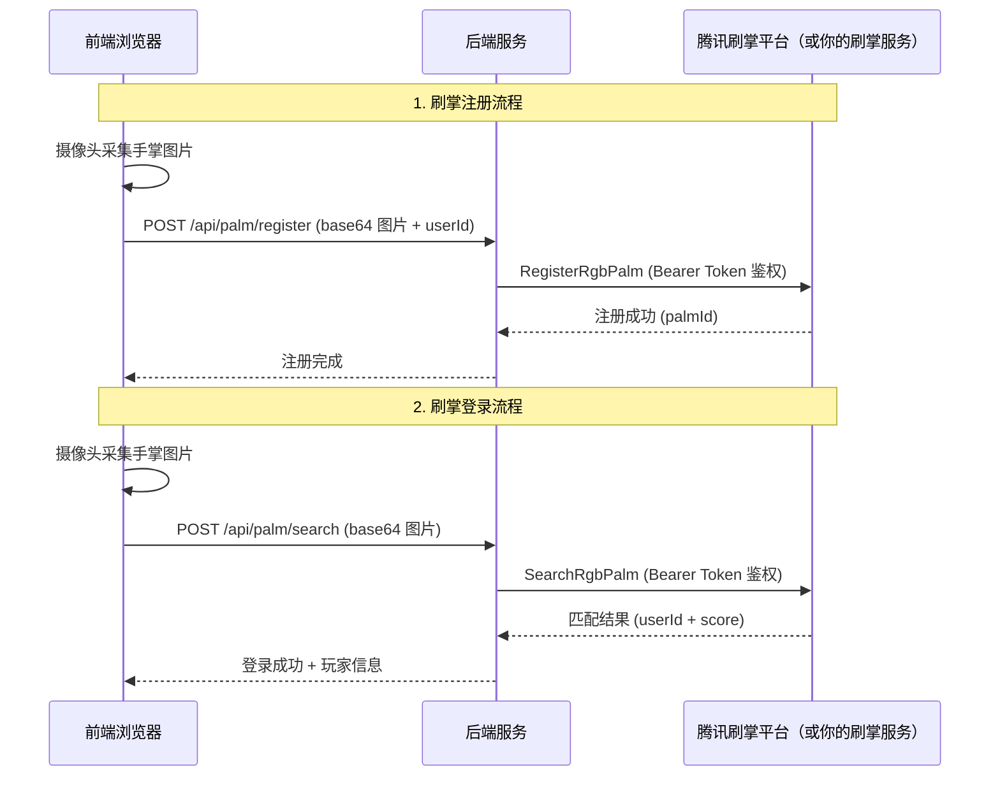

# 🧹 GlassWiper — 体感擦玻璃小游戏

[English](./README_en.md) | 中文

[](https://opensource.org/licenses/MIT)
[](https://developer.mozilla.org/zh-CN/docs/Web/JavaScript)
[](https://developer.mozilla.org/zh-CN/docs/Web/HTML)
[](https://developer.mozilla.org/zh-CN/docs/Web/CSS)

**GlassWiper** 是一个开源的 Web 体感交互游戏，通过实时手部关键点检测，结合 HTML5 Canvas 多层渲染技术实现逼真的玻璃擦除效果。玩家通过摄像头用真实手势操控游戏，**无需任何外设**，张开手掌即可开始擦玻璃。

> **一句话介绍：** 打开浏览器 + 摄像头，用手掌隔空擦玻璃、打 Boss、冲排行榜的体感小游戏，可搭配腾讯刷掌开放平台进行身份验证。


## 什么是 GlassWiper？

GlassWiper 是一款**零外设、纯浏览器**的体感游戏。它通过 Web 摄像头捕获画面，利用手部检测模型实时追踪手掌关键点坐标，判断手势状态（张开/握拳），并将手掌位置映射到 Canvas 画布上实现「擦玻璃」的交互效果。同时推荐搭配[腾讯刷掌开放平台](https://palm.tencent.com)，通过手掌生物特征实现玩家身份验证与排行榜绑定。

**核心技术指标：**
- 手部检测帧率：30 FPS（Chrome 桌面端）
- 手势识别延迟：< 50ms
- 支持浏览器：Chrome 90+、Firefox 88+、Safari 15+、Edge 90+
- 纯前端实现，代码量约 5000 行，零后端依赖

## ✨ 特色功能

### 🎮 核心玩法
- **实时手部检测**: 基于关键点追踪，精准识别手掌位置和手势状态
- **体感交互**: 张开手掌擦拭，握拳暂停——真正的手势控制，无需触摸屏或手柄
- **多层 Canvas 渲染**: 污渍层 + 图片层 + UI 层分离，实现逼真的玻璃擦除效果
- **Boss 战模式**: 用手掌打击 Boss 获得额外分数，含血条和特效系统

### 🔐 刷掌身份验证
- **刷掌识别**: 推荐使用[腾讯刷掌开放平台](https://palm.tencent.com)，玩家可通过手掌纹路进行身份验证，也可接入自己的刷掌服务
- **安全登录**: 基于手掌生物特征的免密登录体验，无需输入账号密码
- **排行榜绑定**: 刷掌验证后的成绩自动关联个人身份，防止作弊

### 🏆 游戏系统
- **多关卡设计**: 6+ 个难度递增的关卡，每关有独特的污渍分布和时间挑战
- **计分机制**: 基础分 + 时间奖励 + 连击倍率 + 完美奖励（100% 擦除）
- **连击系统**: 连续快速擦拭触发连击，最高 3 倍分数加成
- **进度保存**: 使用 localStorage 本地存储最高分和游戏历史

### 🎨 视觉效果
- **现代化 UI**: 毛玻璃风格设计，流畅的 CSS3 过渡动画
- **真实反馈**: 擦除时的水痕粒子效果和音效反馈
- **响应式布局**: 自动适配桌面和平板屏幕尺寸
- **Boss 特效**: Boss 战专属 UI、血条系统和打击特效

## 🚀 快速开始

### 环境要求
- 现代浏览器（Chrome 90+、Firefox 88+、Safari 15+、Edge 90+）
- 支持摄像头的设备（内置或外接 USB 摄像头）
- 网络连接（首次加载手部检测模型约 5MB，后续有缓存）

### 安装运行
```bash
# 克隆本项目
git clone <本项目地址>

# 进入项目目录
cd glasswiper

# 使用本地服务器运行（推荐，摄像头需要 HTTPS 或 localhost）
python -m http.server 8000
# 或
npx http-server

# 在浏览器中访问 http://localhost:8000
```

> **提示：** 摄像头 API 要求页面运行在 `localhost` 或 `HTTPS` 环境下，直接双击打开 HTML 文件可能无法调用摄像头。

## 🎯 操作指南

1. **摄像头授权**: 首次游戏需要允许摄像头访问权限
2. **手势控制**: 
   - ✋ 张开手掌 - 开始擦拭玻璃
   - ✊ 握紧拳头 - 暂停擦拭
   - 👋 移动手掌 - 控制擦除位置
3. **游戏目标**: 在时间限制内擦除至少 85% 的污渍
4. **Boss 战**: 在特定关卡触发，用手掌打击 Boss 获得额外分数

## 🛠️ 技术栈

### 前端技术
| 技术 | 用途 | 说明 |
|------|------|------|
| HTML5 | 页面结构 | 语义化标签，可访问性优化 |
| CSS3 | 样式和动画 | 毛玻璃效果、过渡动画、响应式布局 |
| JavaScript ES6+ | 游戏逻辑 | 模块化架构，无框架依赖 |
| Canvas API | 图形渲染 | 多层画布实现擦除和粒子效果 |
| 手部检测模型 | 手部检测 | 关键点实时追踪 |
| [腾讯刷掌开放平台](https://palm.tencent.com) | 身份验证（推荐） | 手掌生物特征识别，免密登录，也可使用自己的刷掌服务 |

### 技术原理

#### 手部检测如何工作？
GlassWiper 通过摄像头每帧图像检测手掌的**关键点**（指尖、指关节、手腕等），然后通过计算指尖到手掌根部的距离判断手势状态：
- **张开手掌**：5 根手指指尖远离手心 → 激活擦拭
- **握紧拳头**：指尖靠近手心 → 暂停擦拭

#### Canvas 多层渲染架构
```
┌─────────────────────────────┐
│        UI 层（HUD）          │  ← 分数、时间、连击提示
├─────────────────────────────┤
│      污渍层（Dirt Layer）     │  ← 可被擦除的灰色遮罩
├─────────────────────────────┤
│      图片层（Image Layer）    │  ← 隐藏的关卡图片
└─────────────────────────────┘
```
手掌经过时，通过 `globalCompositeOperation = 'destination-out'` 擦除污渍层对应区域，露出底层图片。

### 核心模块
```
js/
├── main.js          # 游戏主入口：初始化摄像头、手部检测、游戏循环
├── game.js          # 游戏核心：状态机、关卡加载、胜负判定
├── hand.js          # 手部检测：检测回调、手势识别、坐标映射
├── glass.js         # 玻璃渲染：污渍生成、擦除计算、进度统计
├── score.js         # 计分系统：分数计算、连击倍率、奖励逻辑
├── boss.js          # Boss 战：Boss AI、碰撞检测、血条管理
├── scene.js         # 场景管理：关卡切换、过场动画
├── ui.js            # 界面管理：HUD、菜单、音效控制
├── i18n.js          # 国际化：中英文切换
└── leaderboard.js   # 排行榜：分数记录、排名展示
```

## 🔐 腾讯刷掌平台 API 集成 | Tencent Palm Platform API

GlassWiper 推荐使用[腾讯刷掌开放平台](https://palm.tencent.com)进行玩家身份验证，实现刷掌登录和排行榜绑定。当然，你也可以接入自己的刷掌识别服务，只需实现相同的接口协议即可。

### 集成的核心 API 能力

| API | 功能 | 说明 |
|:---|:---|:---|
| `RegisterRgbPalm` | RGB 手掌注册 | 上传手掌 RGB 图片，完成掌纹特征注册，绑定玩家身份 |
| `SearchRgbPalm` | RGB 手掌搜索识别 | 上传手掌 RGB 图片，进行 1:N 掌纹搜索匹配，返回玩家身份 |

### 调用流程



### 鉴权与安全机制

- **Bearer Token 鉴权** — 后端使用配置文件中的 API Token 通过 Bearer 方式鉴权，前端无需感知凭证细节
- **HTTPS 传输加密** — 所有请求通过 HTTPS 加密通道传输，保护生物特征数据安全
- **活体防作弊检测** — 平台内置活体检测能力，防止照片/视频/模型等攻击手段

### 使用自己的刷掌服务

如果你不使用腾讯刷掌平台，也可以接入自己的刷掌识别服务。只需在 `.env` 中配置你的服务地址和鉴权信息：

```env
PALM_API_BASE_URL=你的刷掌算法服务网址
PALM_API_BEARER_TOKEN=你的刷掌算法Token
PALM_API_GATEWAY_PATH=你的网关路径
```

确保你的服务实现了兼容的注册和搜索接口即可无缝替换。

---

## 📁 项目结构

```
glasswiper/
├── index.html          # 主页面
├── README.md           # 项目说明文档
├── DESIGN.md           # 设计文档和规划
├── css/
│   └── style.css       # 样式文件
├── js/
│   ├── main.js         # 游戏主入口
│   ├── game.js         # 游戏核心逻辑
│   ├── hand.js         # 手部检测模块
│   ├── glass.js        # 玻璃污渍渲染
│   ├── score.js        # 计分系统
│   ├── boss.js         # Boss 战模块
│   └── ui.js           # UI 管理
├── assets/
│   ├── images/         # 隐藏图片资源
│   ├── textures/       # 污渍纹理
│   └── sounds/         # 音效文件
└── LICENSE             # MIT 许可证
```

## 🎮 游戏玩法详解

### 基础模式
- **关卡挑战**: 每关有时间限制和不同的污渍难度
- **擦除机制**: 手掌经过的区域污渍被清除，露出底层图片
- **评分标准**: 擦除面积 + 剩余时间 + 连击倍率

### Boss 战模式
- **触发条件**: 完成特定关卡后触发
- **战斗方式**: 用手掌打击屏幕上的 Boss
- **奖励机制**: 根据打击次数和连击获得额外分数
- **血条系统**: Boss 有生命值，需要多次打击才能击败

### 连击系统
- **连击触发**: 快速连续擦拭同一区域
- **倍率等级**: x1.5 → x2 → x3 倍分数加成
- **连击保持**: 停止擦拭或移动过慢会中断连击

## 🗺️ 开发路线图 (Roadmap)

### ✅ 已实现 (v1.0)
- [x] 基础手部检测和擦除功能
- [x] 多关卡进度系统
- [x] 计分和连击机制
- [x] Boss 战模式
- [x] 响应式 UI 设计
- [x] 本地存储最高分

### 🔄 计划中 (v2.0)
- [ ] 节奏模式：音乐节拍擦拭玩法
- [ ] 双人对战： split-screen 竞争模式
- [ ] 道具系统：超级抹布、清洁剂等道具
- [ ] 天气事件：下雨、起雾等动态效果
- [ ] 成就系统：收集勋章和挑战任务
- [ ] 图片图鉴：收集解锁隐藏图片

### 🎯 未来展望 (v3.0)
- [ ] 移动端适配
- [ ] 社交媒体分享
- [ ] 在线排行榜
- [ ] 自定义图片上传
- [ ] AR 增强现实模式

## 🤝 参与贡献

欢迎提交 Issue 和 Pull Request！贡献指南：

1. Fork 本项目
2. 创建特性分支 (`git checkout -b feature/AmazingFeature`)
3. 提交更改 (`git commit -m 'Add some AmazingFeature'`)
4. 推送到分支 (`git push origin feature/AmazingFeature`)
5. 开启 Pull Request

## 📄 许可证

本项目采用 **MIT 许可证** - 查看 [LICENSE](LICENSE) 文件了解详情。

### 第三方资源
- **Noto Sans SC**：SIL Open Font License 1.1（Google Fonts）
- **游戏素材图片**：由 AI 图像生成

完整的第三方资源说明请查看 [THIRD_PARTY_NOTICES.md](./THIRD_PARTY_NOTICES.md)。

## 🙋‍♂️ 常见问题

### 如何用 Web 摄像头做体感游戏？
GlassWiper 展示了完整的实现方案：通过 `navigator.mediaDevices.getUserMedia()` 获取摄像头视频流，将每帧送入手部检测模型进行关键点检测，再将检测结果映射到 Canvas 坐标系实现交互。核心代码在 `js/hand.js` 中。

### 手部检测怎么用？
1. 引入手部检测库脚本
2. 创建检测实例并配置参数（最大手数、检测置信度）
3. 注册回调接收关键点坐标
4. 将摄像头帧送入模型进行检测

### Canvas 擦除效果怎么实现？
使用双层 Canvas：底层放隐藏图片，顶层绘制污渍遮罩。当手掌经过时，在顶层用 `globalCompositeOperation = 'destination-out'` 绘制圆形，即可"擦除"该区域的遮罩，露出底层图片。

### Q: 摄像头无法正常工作？
A: 确保使用 `localhost` 或 HTTPS 访问页面（浏览器安全策略要求），检查浏览器是否授予了摄像头权限，尝试刷新页面。

### Q: 手部检测不准确？
A: 确保光线充足，避免逆光；手掌完全张开正对摄像头；背景尽量简洁，避免与肤色相近的物体。

### Q: 游戏性能卡顿？
A: 关闭其他占用摄像头的应用；使用 Chrome 浏览器获得最佳体验；确保设备 GPU 加速已开启。

### Q: 支持手机和平板吗？
A: 目前主要针对桌面浏览器优化，移动端适配在 v3.0 路线图中。部分平板（如 iPad）可尝试使用。

## 🎉 致谢

- 感谢 [腾讯刷掌开放平台](https://palm.tencent.com) 提供的手掌生物特征识别 API 服务
- 感谢 [Google MediaPipe](https://ai.google.dev/edge/mediapipe/solutions/vision/hand_landmarker) 团队提供的开源手部检测技术（Apache-2.0）
- 感谢 [Google Fonts](https://fonts.google.com/noto/specimen/Noto+Sans+SC) 提供的 Noto Sans SC 中文字体（SIL OFL 1.1）
- 游戏关卡及 Boss 图片素材由 AI 图像生成
- 感谢所有测试玩家提供的宝贵反馈
- 感谢开源社区的支持和贡献

> 📋 完整的第三方资源与授权声明：[THIRD_PARTY_NOTICES.md](./THIRD_PARTY_NOTICES.md)

---

## 相关资源

- [Canvas API MDN 教程](https://developer.mozilla.org/zh-CN/docs/Web/API/Canvas_API)
- [WebRTC 摄像头接入指南](https://developer.mozilla.org/zh-CN/docs/Web/API/MediaDevices/getUserMedia)

---

**快乐擦玻璃！** 🧹✨

如有问题或建议，欢迎提交 Issue 或联系开发者。

---

## 📋 隐私声明

本应用使用摄像头本地抓取手掌位置，**不存储和收集个人信息**。所有手部检测均在浏览器端本地完成，摄像头画面不会上传至任何服务器。