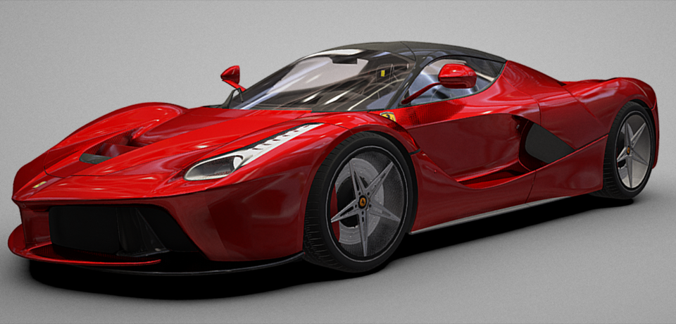
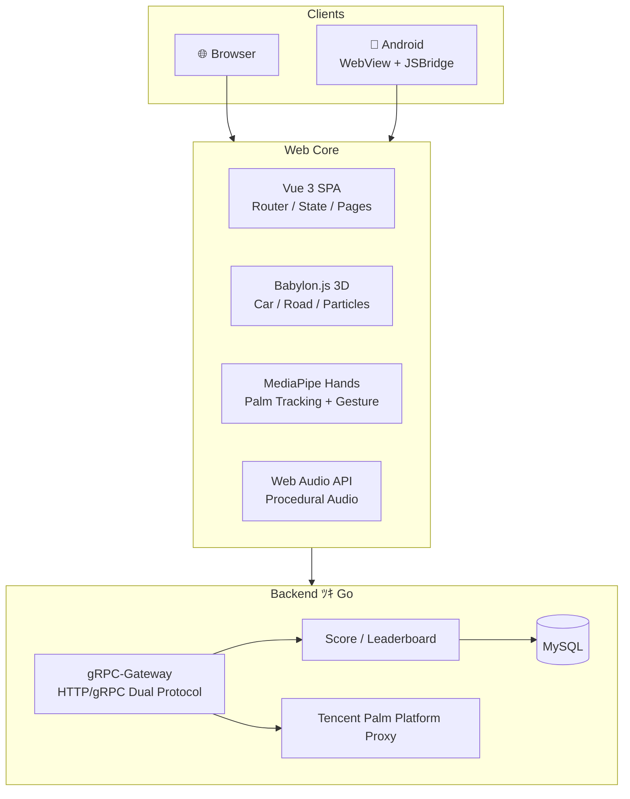
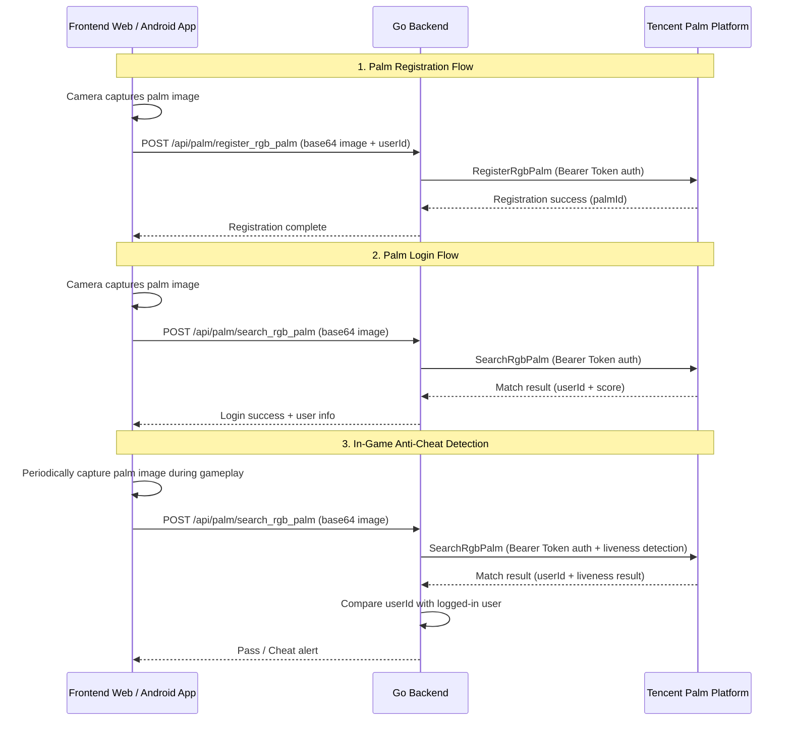
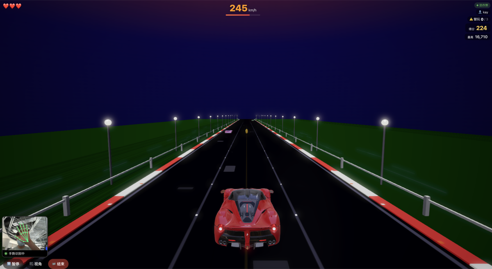
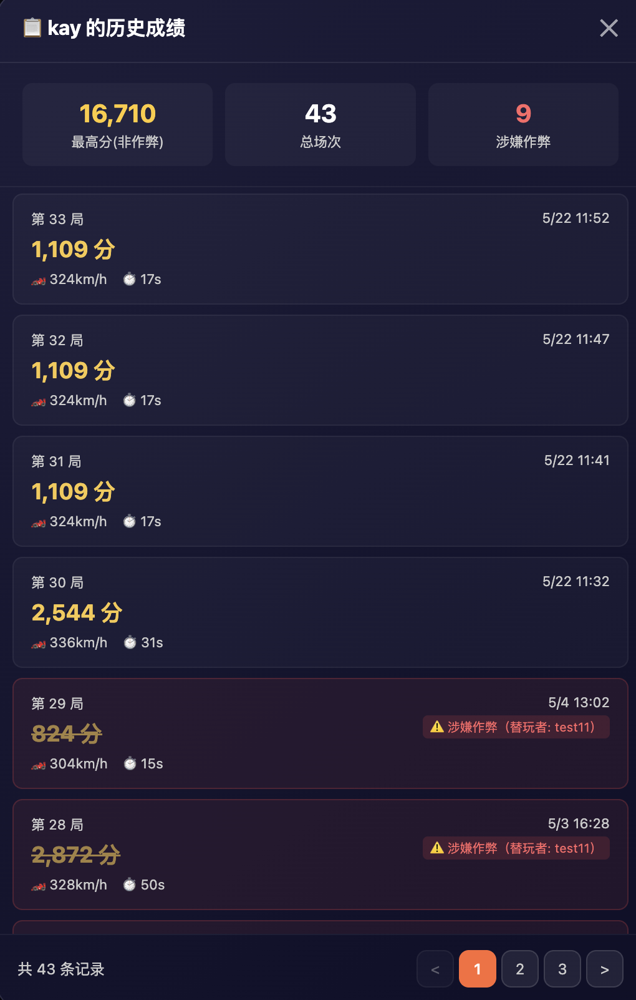
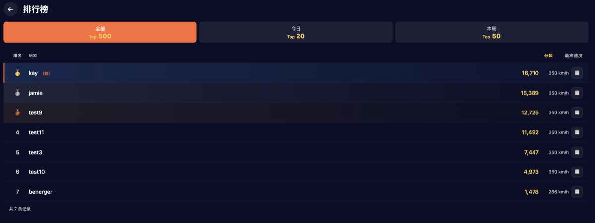

<p align="center">
  
</p>

<h1 align="center">Palm Racer 🏎️</h1>

<p align="center">
  <strong>Palm-gesture controlled 3D racing game</strong>
</p>

<p align="center">
  <a href="LICENSE"></a>
  <a href="server/"></a>
  <a href="web/"></a>
  <a href="web/"></a>
  <a href="web/"></a>
  <a href="CODE_OF_CONDUCT.md"></a>
</p>

<p align="center">
  <a href="#quick-start">Quick Start</a> •
  <a href="#features">Features</a> •
  <a href="#documentation">Documentation</a> •
  <a href="#contributing">Contributing</a> •
  <a href="README.md">中文</a>
</p>

> **Palm Racer** is an open-source 3D racing game controlled entirely by hand gestures via MediaPipe — no controller needed. It supports optional integration with palm recognition platforms (recommended: [Tencent Palm Recognition Open Platform](https://palm.tencent.com)) for palm registration, palm login, and anti-cheat detection.

---

## 📖 Introduction

**Palm Racer** is a gesture-controlled racing game that captures your hand posture through the camera to control a 3D racing car — steering, accelerating, and braking. All hand tracking runs locally in the browser. The project supports integration with palm recognition platforms (recommended: [Tencent Palm Recognition Open Platform](https://palm.tencent.com)) for optional palm registration, palm login, and liveness-based anti-cheat detection. Available on Web browsers and Android.

---

## 🎮 Demo

<p align="center">
  
</p>

---

<a id="features"></a>

## ✨ Features

- 🖐️ **Palm Gesture Control** — Real-time hand tracking via MediaPipe Hands, runs entirely locally, no controller or keyboard needed
- 🔐 **Palm Authentication (Optional)** — Supports integration with palm recognition platforms (recommended: [Tencent Palm Recognition Open Platform](https://palm.tencent.com)) for optional palm registration, palm login, and liveness-based anti-cheat detection
- 🏎️ **3D Racing Engine** — Babylon.js powered 3D track, vehicle physics, and particle effects
- 🌐 **Cross-Platform** — Single Web codebase runs on both browsers and Android WebView
- 🔊 **Procedural Audio** — Real-time engine sounds and ambient audio via Web Audio API
- 📊 **Leaderboard** — Go backend service for score recording and global rankings

---

## 📱 Platform Support

| Platform | Status | Notes |
|:---:|:---:|:---|
| 🌐 Web (Chrome/Edge/Safari) | ✅ Supported | Chrome 90+ recommended, camera permission required |
| 📱 Android | ✅ Supported | Android 8.0+, native shell + WebView |
| 🍎 iOS | ❌ Not yet | Not adapted |

---

## 🕹️ Controls

| Gesture | Action |
|:---:|:---|
| 🖐️ Open palm | Auto Accelerate |
| 🖐️ ↔️ Move palm left/right | Steering |
| ✊ Make a fist | Brake |

---

<a id="quick-start"></a>

## 🚀 Quick Start

A root `Makefile` provides unified commands. Run `make help` to see all available targets:

```bash
make help          # Show all commands
make build-web     # Build web frontend
make dev-server    # Start backend service (dev mode)
make build         # Build everything (Web + Server)
make build-server  # Build server binary
make test          # Run all tests
make docker-up     # One-click docker compose startup
make docker-down   # Stop docker compose
make clean         # Clean build artifacts
```

### Backend Service

Edit the configuration file `server/conf/palm-racer.yaml` to fill in your palm platform credentials and database connection info:

```bash
$EDITOR server/conf/palm-racer.yaml
```

Build and start the backend service:

```bash
make dev-server
```

### Web Frontend

Build the frontend static assets:

```bash
make build-web
```

Once built, the backend service will automatically serve the frontend. Visit `http://localhost:9090` in your browser, allow camera access, and start racing!

### Android Build

```bash
make build-android
```

### Docker Deployment (Recommended)

```bash
make docker-up
```

This launches the full environment via docker compose (server + mysql). Visit `http://localhost:9090` to start racing!

Stop services:

```bash
make docker-down
```

---

## 🏗️ Tech Stack

| Layer | Technology |
|:---|:---|
| Palm Authentication (Optional) | [Tencent Palm Recognition Open Platform](https://palm.tencent.com) (Registration/Login/Liveness Anti-cheat) |
| Web Frontend | Vue 3 + TypeScript + Vite + Babylon.js |
| Palm Tracking | MediaPipe Hands (WASM) |
| Android Client | Java + WebView + JSBridge |
| Backend Service | Go (gRPC + gRPC-Gateway + Gin) |
| Database | MySQL |

---

## 🏛️ Architecture



---

## 🔐 Tencent Palm Platform API Integration (Optional)

Palm Racer supports integration with [Tencent Palm Recognition Open Platform](https://palm.tencent.com) through a backend proxy, providing the following optional palm authentication capabilities (if you don't need palm authentication, you can use Guest Mode to experience the game directly):

| API | Function | Description |
|:---|:---|:---|
| `RegisterRgbPalm` | RGB Palm Registration | Upload palm RGB image to register palm print features and bind user identity |
| `SearchRgbPalm` | RGB Palm Search | Upload palm RGB image for 1:N palm print matching, returns user identity |

### Call Flow



### Authentication & Security

- **Bearer Token Authentication** — Backend authenticates with the platform using a configured API Token via Bearer scheme; frontend needs no credential awareness
- **HTTPS Encrypted Transport** — All requests transmitted over HTTPS encrypted channel to protect biometric data
- **Liveness Anti-Cheat Detection** — Built-in liveness detection prevents photo/video/model-based attacks
- **Request Tracing** — Each request automatically generates an X-TraceId for end-to-end troubleshooting

---

## 📂 Project Structure

```
palm-racer/
├── web/                # Vue 3 + Babylon.js frontend (core)
│   ├── public/
│   │   ├── mediapipe/  #   MediaPipe WASM models
│   │   └── models/     #   3D car models (.glb)
│   └── src/
│       ├── engine/     #   Babylon.js 3D engine
│       ├── tracking/   #   Palm tracking + gesture recognition
│       └── ...
├── server/             # Go backend service
├── android/            # Android native shell
├── scripts/            # Build and deployment scripts
├── Makefile            # Root entry point (run `make help` for all commands)
├── Dockerfile          # Multi-stage Docker build (single container)
└── docker-compose.yml  # One-click local setup (server + mysql)
```

---

---

## 🖼️ Showcase

<table>
  <tr>
    <td align="center"><b>Game UI</b><br/></td>
    <td align="center"><b>History</b><br/></td>
    <td align="center"><b>Leaderboard</b><br/></td>
  </tr>
</table>

---

<a id="contributing"></a>

## 🤝 Contributing

We welcome all forms of contributions! Please read [**CONTRIBUTING.md**](CONTRIBUTING.md) to learn about:

- Development environment setup
- Code style guidelines
- PR submission process
- Commit message conventions

> See also [Code of Conduct](CODE_OF_CONDUCT.md) · [Security Policy](SECURITY.md)

---

<a id="faq"></a>

## ❓ FAQ

### What is Palm Racer?

Palm Racer is an open-source gesture-controlled racing game that uses your webcam and MediaPipe hand tracking to let you steer a 3D car with your palm — no controller needed. It's available on Web browsers and Android.

### How does palm gesture control work?

Palm Racer uses Google's MediaPipe Hands (running in WASM) to detect 21 hand landmarks in real-time. The palm's horizontal position maps to steering, an open palm means accelerate, and a closed fist means brake. All processing happens locally in the browser — no data is sent to any server.

### What technologies does Palm Racer use?

- **Frontend**: Vue 3 + TypeScript + Babylon.js (3D engine)
- **Palm Tracking**: MediaPipe Hands (WASM, runs locally in browser)
- **Android Client**: Java + WebView + JSBridge
- **Backend**: Go (gRPC-Gateway)
- **Platforms**: Web browsers, Android

### What Tencent Palm Platform capabilities are integrated?

Palm Racer supports integration with Tencent's Palm Recognition Open Platform, providing the following optional palm authentication capabilities:

- **Palm Registration** — Users register their palm prints via camera, binding biometric identity to their game account
- **Palm Login** — Password-free authentication by simply scanning your palm to log in
- **Anti-Cheat Detection** — Liveness detection and palm print authenticity verification to prevent photo/video/model-based attacks, ensuring fair gameplay

> 💡 If you don't need palm authentication, you can use Guest Mode to experience the game directly. Palm Racer also serves as a complete reference example for integrating the Tencent Palm Recognition Platform API.

### Can I use Palm Racer for learning?

Yes! Palm Racer is Apache 2.0-licensed and designed as a reference project for:

- **Tencent Palm Recognition Platform API integration reference** (registration, login, anti-cheat) — the most complete palm platform integration example
- MediaPipe hand tracking integration in web apps
- Babylon.js 3D game development
- Vue 3 + TypeScript best practices
- Go backend with gRPC-Gateway
- Android WebView hybrid app development

### What hardware do I need?

Just a computer or Android phone with a camera. Chrome 90+ is recommended for the best experience.

### How is it different from other gesture-controlled games?

| Feature | Palm Racer | Handtrack.js Demo | TensorFlow.js Pacman |
|:---|:---:|:---:|:---:|
| 3D Graphics | ✅ Babylon.js | ❌ 2D Canvas | ❌ 2D |
| Hand Tracking | MediaPipe Hands | Handtrack.js | PoseNet |
| Cross-Platform | Web + Android | Web only | Web only |
| Backend/Leaderboard | ✅ Go service | ❌ | ❌ |
| Tencent Palm Recognition Platform | ✅ Registration/Login/Anti-cheat | ❌ | ❌ |
| License | Apache 2.0 | MIT | Apache 2.0 |

---

## 🏷️ GitHub Topics

> Recommended topics for this repository:

`palm-recognition` · `palm-registration` · `palm-login` · `anti-cheat` · `liveness-detection` · `gesture-control` · `hand-tracking` · `racing-game` · `mediapipe` · `babylonjs` · `webgl` · `vue3` · `typescript` · `golang` · `3d-game` · `computer-vision` · `hand-gesture` · `web-game` · `open-source-game` · `biometric-authentication`

---

## 🙏 Acknowledgments

- [Tencent Palm Recognition Open Platform](https://palm.tencent.com) — Palm print authentication capabilities including registration, login, and anti-cheat detection (recommended integration)
- [Google MediaPipe](https://github.com/google-ai-edge/mediapipe) — High-performance real-time hand tracking and gesture recognition
- [Babylon.js](https://github.com/BabylonJS/Babylon.js) — Powerful open-source Web 3D rendering engine
- [Vue.js](https://github.com/vuejs/core) — Progressive JavaScript frontend framework
- [Go](https://go.dev) — Simple and efficient backend programming language

---

## 📄 License

The source code of this project is open-sourced under the [Apache License 2.0](LICENSE).

### Third-Party Assets

The 3D car model used in this project is sourced from Sketchfab and licensed under [CC BY 4.0](https://creativecommons.org/licenses/by/4.0/), which is **not covered by the Apache 2.0 License**. See [THIRD_PARTY_NOTICES](THIRD_PARTY_NOTICES) for full attribution details.

| Asset | Author | License |
|:---|:---|:---|
| Ferrari LaFerrari 3D Model | [wwwvecarzcom](https://sketchfab.com/3d-models/ferrari-laferrari-wwwvecarzcom-979f7085012e4d6399f38de3f9c39012) | CC BY 4.0 |

---

<p align="center">
  If you find this project useful, please give it a ⭐ Star!
</p>
