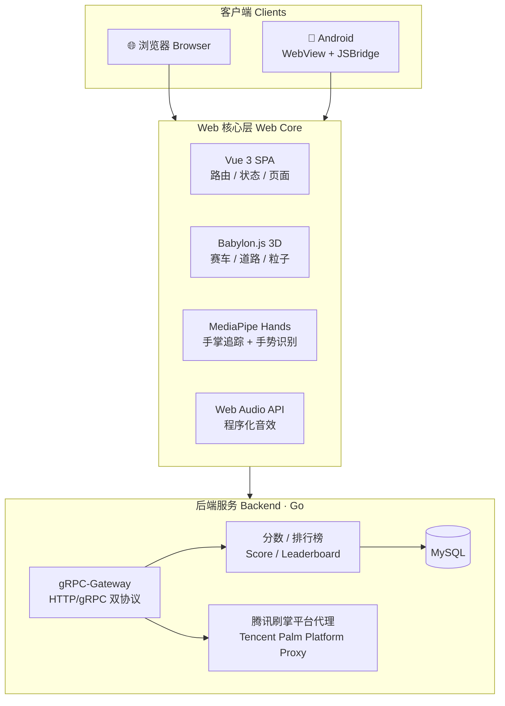
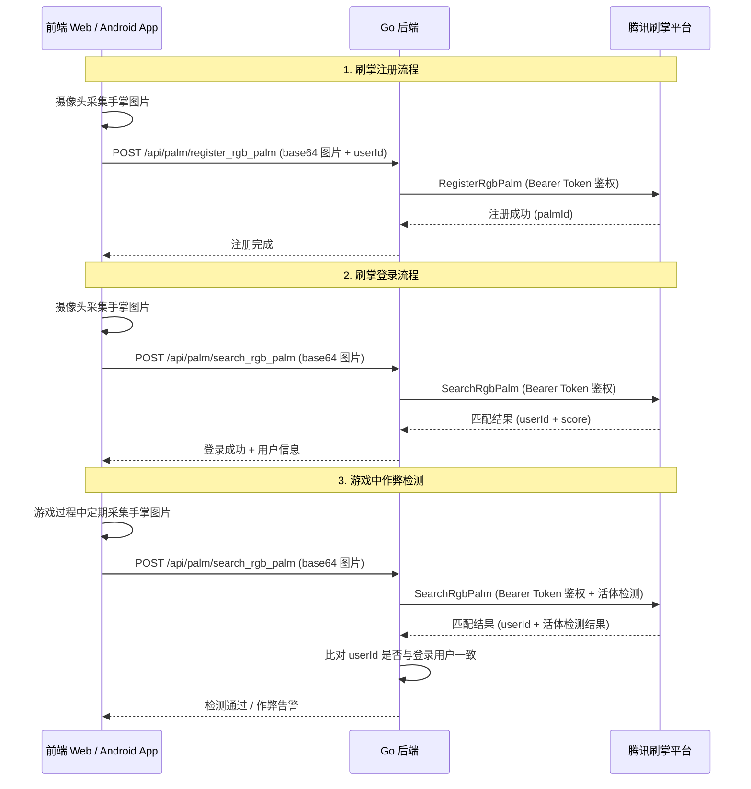

<p align="center">
  
</p>

<h1 align="center">Palm Racer 🏎️ 掌上赛车</h1>

<p align="center">
  <strong>基于手掌识别的体感竞速游戏 | Palm-gesture controlled racing game</strong>
</p>

<p align="center">
  <a href="LICENSE"></a>
  <a href="server/"></a>
  <a href="web/"></a>
  <a href="web/"></a>
  <a href="web/"></a>
  <a href="CODE_OF_CONDUCT.md"></a>
</p>

<p align="center">
  <a href="#quick-start">快速开始</a> •
  <a href="#features">特性</a> •
  <a href="#documentation">文档</a> •
  <a href="#contributing">贡献</a> •
  <a href="README.en.md">English</a>
</p>

> **Palm Racer** 是一个开源 3D 体感赛车游戏，通过 MediaPipe 手掌追踪实现纯手势控制——无需手柄或键盘。支持对接掌纹身份认证平台（推荐[腾讯刷掌开放平台](https://palm.tencent.com)），实现刷掌注册、刷掌登录和防作弊检测。

---

## 📖 简介 | Introduction

**Palm Racer（掌上赛车）** 是一个基于手掌手势控制的体感竞速游戏。通过摄像头实时捕捉手掌姿态，控制 3D 赛车的转向、加速和刹车——所有手势追踪均在本地运行。项目支持对接掌纹身份认证平台（推荐[腾讯刷掌开放平台](https://palm.tencent.com)），可选启用掌纹注册、掌纹登录和活体防作弊检测，支持 Web 浏览器与 Android 平台。

**Palm Racer** is a gesture-controlled racing game that captures your hand posture through the camera to control a 3D racing car — steering, accelerating, and braking. All hand tracking runs locally in the browser. The project supports integration with palm recognition platforms (recommended: [Tencent Palm Recognition Open Platform](https://palm.tencent.com)) for optional palm registration, palm login, and liveness-based anti-cheat detection. Available on Web browsers and Android.

---

## 🎮 演示 | Demo

<p align="center">
  
</p>

---

<a id="features"></a>

## ✨ 特性 | Features

- 🖐️ **手掌体感控制 | Palm Gesture Control** — 基于 MediaPipe Hands 实时手掌追踪，纯本地运行，无需手柄或键盘
- 🔐 **掌纹身份认证（可选）| Palm Authentication (Optional)** — 支持对接掌纹身份认证平台（推荐[腾讯刷掌开放平台](https://palm.tencent.com)），可选启用刷掌注册、刷掌登录和活体防作弊检测
- 🏎️ **3D 赛车引擎 | 3D Racing Engine** — Babylon.js 驱动的 3D 赛道、车辆物理和粒子特效
- 🌐 **跨平台 | Cross-Platform** — 一套 Web 代码同时运行于浏览器和 Android WebView
- 🔊 **程序化音效 | Procedural Audio** — Web Audio API 实时合成引擎声浪和环境音效
- 📊 **排行榜 | Leaderboard** — Go 后端服务支持分数记录与全局排行

---

## 📱 平台支持 | Platform Support

| 平台 Platform | 状态 Status | 说明 Notes |
|:---:|:---:|:---|
| 🌐 Web (Chrome/Edge/Safari) | ✅ 支持 | 推荐 Chrome 90+，需要摄像头权限 |
| 📱 Android | ✅ 支持 | Android 8.0+，原生壳 + WebView |
| 🍎 iOS | ❌ 暂不支持 | 尚未适配 |

---

## 🕹️ 操控指南 | Controls

| 手势 Gesture | 操作 Action |
|:---:|:---|
| 🖐️ 伸出手掌 | 自动加速 Auto Accelerate |
| 🖐️ ↔️ 手掌左右移动 | 转向 Steering |
| ✊ 握拳 | 刹车 Brake |

---

<a id="quick-start"></a>

## 🚀 快速开始 | Quick Start

项目提供根目录 `Makefile` 作为统一入口，运行 `make help` 查看所有可用命令：

```bash
make help          # 查看所有命令
make build-web     # 编译 Web 前端
make dev-server    # 启动后端服务（开发模式）
make build         # 构建全部（Web + Server）
make build-server  # 编译后端二进制
make test          # 运行全部测试
make docker-up     # docker compose 一键启动
make docker-down   # 停止 docker compose
make clean         # 清理构建产物
```

### 后端服务

编辑配置文件 `server/conf/palm-racer.yaml`，填写刷掌平台凭据和数据库连接信息：

```bash
$EDITOR server/conf/palm-racer.yaml
```

编译并启动后端服务：

```bash
make dev-server
```

### Web 前端

编译前端静态资源：

```bash
make build-web
```

编译完成后，后端服务会自动托管前端页面，浏览器访问 `http://localhost:9090`，允许摄像头权限即可开始游戏。

### Android 构建

```bash
make build-android
```

### Docker 一键部署（推荐）

```bash
make docker-up
```

这将通过 docker compose 启动完整环境（server + mysql）。访问 `http://localhost:9090` 即可开始游戏。

停止服务：

```bash
make docker-down
```

---

## 🏗️ 技术栈 | Tech Stack

| 层 Layer | 技术 Technology |
|:---|:---|
| 掌纹身份认证 Palm Auth（可选） | [腾讯刷掌开放平台](https://palm.tencent.com)（注册/登录/活体防作弊） |
| Web 前端 Frontend | Vue 3 + TypeScript + Vite + Babylon.js |
| 手掌追踪 Palm Tracking | MediaPipe Hands (WASM) |
| Android 客户端 | Java + WebView + JSBridge |
| 后端服务 Backend | Go (gRPC + gRPC-Gateway + Gin) |
| 数据库 Database | MySQL |

---

## 🏛️ 架构概览 | Architecture



---

## 🔐 腾讯刷掌平台 API 集成（可选）| Tencent Palm Platform API (Optional)

Palm Racer 支持通过后端代理对接[腾讯刷掌开放平台](https://palm.tencent.com)，提供以下可选的掌纹身份认证能力（如不需要掌纹认证功能，可使用游客模式直接体验游戏）：

| API | 功能 | 说明 |
|:---|:---|:---|
| `RegisterRgbPalm` | RGB 手掌注册 | 上传手掌 RGB 图片，完成掌纹特征注册，绑定用户身份 |
| `SearchRgbPalm` | RGB 手掌搜索识别 | 上传手掌 RGB 图片，进行 1:N 掌纹搜索匹配，返回用户身份 |

### 调用流程



### 鉴权与安全机制

- **Bearer Token 鉴权** — 后端使用配置文件中的 API Token 通过 Bearer 方式鉴权，前端无需感知凭证细节
- **HTTPS 传输加密** — 所有请求通过 HTTPS 加密通道传输，保护生物特征数据安全
- **活体防作弊检测** — 平台内置活体检测能力，防止照片/视频/模型等攻击手段
- **请求追踪** — 每次请求自动生成 X-TraceId，便于全链路问题排查

---

## 📂 项目结构 | Project Structure

```
palm-racer/
├── web/                # Vue 3 + Babylon.js 前端工程（核心）
│   ├── public/
│   │   ├── mediapipe/  #   MediaPipe WASM 模型
│   │   └── models/     #   3D 赛车模型 (.glb)
│   └── src/
│       ├── engine/     #   Babylon.js 3D 引擎
│       ├── tracking/   #   手掌追踪 + 手势识别
│       └── ...
├── server/             # Go 后端服务
├── android/            # Android 原生壳
├── scripts/            # 构建与部署脚本
├── Makefile            # 根目录统一入口（make help 查看所有命令）
├── Dockerfile          # Docker 多阶段构建（单容器部署）
└── docker-compose.yml  # 一键启动完整环境（server + mysql）
```

---

---

## 🖼️ Showcase

<table>
  <tr>
    <td align="center"><b>游戏主界面</b><br/></td>
    <td align="center"><b>历史成绩</b><br/></td>
    <td align="center"><b>排行榜</b><br/></td>
  </tr>
</table>

---

<a id="contributing"></a>

## 🤝 贡献 | Contributing

我们欢迎任何形式的贡献！请阅读 [**CONTRIBUTING.md**](CONTRIBUTING.md) 了解：

- 开发环境搭建
- 代码风格规范
- 提交 PR 的流程
- Commit Message 规范

> 参见 [行为准则 Code of Conduct](CODE_OF_CONDUCT.md) · [安全政策 Security Policy](SECURITY.md)

---

<a id="faq"></a>

## ❓ 常见问题 | FAQ

### Palm Racer 是什么？

Palm Racer（掌上赛车）是一个开源的手势控制赛车游戏。通过摄像头和 MediaPipe 手掌追踪技术，你可以用手掌控制 3D 赛车的转向、加速和刹车——无需任何手柄或键盘。

### 手掌体感控制是如何工作的？

Palm Racer 使用 Google 的 MediaPipe Hands（以 WASM 形式运行在浏览器中）实时检测手掌的 21 个关键点。手掌的水平位置映射为转向，张开手掌表示加速，握拳表示刹车。

### 使用了哪些技术？

- **前端**: Vue 3 + TypeScript + Babylon.js (3D 引擎)
- **手掌追踪**: MediaPipe Hands (WASM，本地运行)
- **Android 客户端**: Java + WebView + JSBridge
- **后端**: Go (gRPC-Gateway)
- **平台**: Web 浏览器、Android

### 刷掌平台集成了哪些能力？

Palm Racer 支持对接腾讯刷掌开放平台，提供以下可选的掌纹身份认证能力：

- **刷掌注册** — 用户通过摄像头采集掌纹，完成掌纹特征注册，绑定游戏账号
- **刷掌登录** — 无需密码，刷掌即可完成身份认证并登录游戏
- **作弊检测** — 基于活体检测和掌纹真伪验证，防止照片/视频/模型等攻击手段，确保游戏公平性

> 💡 如不需要掌纹认证功能，可直接使用游客模式体验游戏。Palm Racer 同时也是腾讯刷掌开放平台 API 接入的完整参考示例。

### 可以用来学习吗？

当然可以！Palm Racer 基于 Apache 2.0 协议开源，非常适合作为以下技术的学习参考项目：

- **腾讯刷掌开放平台 API 接入参考**（掌纹注册、掌纹登录、活体防作弊检测）— 最完整的刷掌平台接入示例
- MediaPipe 手掌追踪集成
- Babylon.js 3D 游戏开发
- Vue 3 + TypeScript 最佳实践
- Go 后端 + gRPC-Gateway 服务开发
- Android WebView 混合应用开发

### 需要什么硬件？

只需要一台带摄像头的电脑或 Android 手机即可。推荐使用 Chrome 90+ 浏览器以获得最佳体验。

### 与其他手势控制游戏有什么不同？

| 特性 | Palm Racer | Handtrack.js Demo | TensorFlow.js Pacman |
|:---|:---:|:---:|:---:|
| 3D 图形 | ✅ Babylon.js | ❌ 2D Canvas | ❌ 2D |
| 手掌追踪 | MediaPipe Hands | Handtrack.js | PoseNet |
| 跨平台 | Web + Android | 仅 Web | 仅 Web |
| 后端/排行榜 | ✅ Go 服务 | ❌ | ❌ |
| 腾讯刷掌平台集成 | ✅ 注册/登录/作弊检测 | ❌ | ❌ |
| 开源协议 | Apache 2.0 | MIT | Apache 2.0 |

---

## 🏷️ GitHub Topics

> 建议为本仓库设置以下 Topics：

`palm-recognition` · `palm-registration` · `palm-login` · `anti-cheat` · `liveness-detection` · `gesture-control` · `hand-tracking` · `racing-game` · `mediapipe` · `babylonjs` · `webgl` · `vue3` · `typescript` · `golang` · `3d-game` · `computer-vision` · `hand-gesture` · `web-game` · `open-source-game` · `biometric-authentication`

---

## 🙏 致谢 | Acknowledgments

- [腾讯刷掌开放平台](https://palm.tencent.com) — 提供刷掌注册、刷掌登录与作弊检测等掌纹身份认证能力（推荐接入）
- [Google MediaPipe](https://github.com/google-ai-edge/mediapipe) — 高性能实时手掌追踪与手势识别
- [Babylon.js](https://github.com/BabylonJS/Babylon.js) — 强大的开源 Web 3D 渲染引擎
- [Vue.js](https://github.com/vuejs/core) — 渐进式 JavaScript 前端框架
- [Go](https://go.dev) — 简洁高效的后端编程语言

---

## 📄 License

本项目源代码基于 [Apache License 2.0](LICENSE) 开源。

### 第三方资产 | Third-Party Assets

本项目中的 3D 赛车模型来自 Sketchfab，使用 [CC BY 4.0](https://creativecommons.org/licenses/by/4.0/) 许可证，**不受 Apache 2.0 许可证覆盖**。详细的第三方资产归属信息请参阅 [THIRD_PARTY_NOTICES](THIRD_PARTY_NOTICES)。

| 资产 Asset | 作者 Author | 许可证 License |
|:---|:---|:---|
| Ferrari LaFerrari 3D Model | [wwwvecarzcom](https://sketchfab.com/3d-models/ferrari-laferrari-wwwvecarzcom-979f7085012e4d6399f38de3f9c39012) | CC BY 4.0 |

---

<p align="center">
  如果这个项目对你有帮助，请给一个 ⭐ Star！<br/>
  If you find this project useful, please give it a ⭐ Star!
</p>
